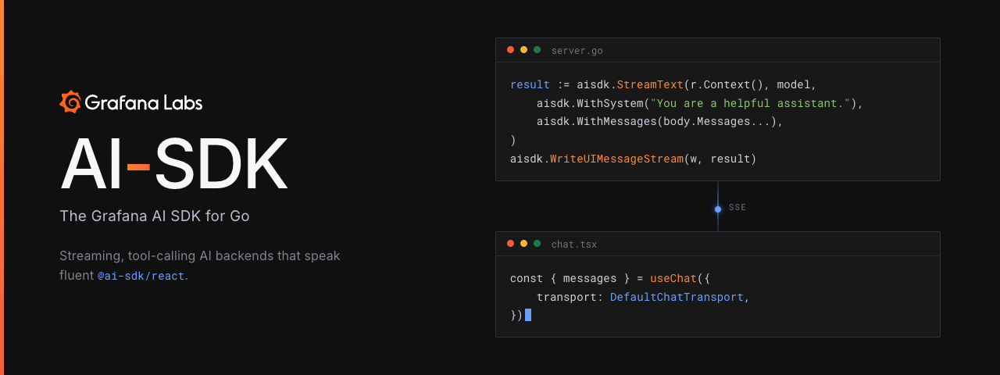

<div align="center">



Call language models, stream responses, execute tools, and serve AI-powered
endpoints from Go. Use the SDK on its own or pair it with an AI SDK React
frontend.

[Quick start](#quick-start) · [Documentation](docs/README.md) · [Examples](examples/) · [API reference](https://pkg.go.dev/github.com/grafana/ai-sdk)

</div>

---

## Why

The SDK gives Go applications one API for model calls, streaming, tools,
structured output, and multi-step agents across supported providers. It follows
the design of [Vercel's AI SDK](https://ai-sdk.dev) and stays wire-compatible
with its TypeScript frontend hooks. A Go endpoint can stream Server-Sent Events
(SSE) directly to hooks such as `useChat`.

```text
   Go backend                          React frontend
   ──────────                          ──────────────
   aisdk.StreamText(...)   ── SSE ──▶  useChat({ transport })
   aisdk.WriteUIMessageStream(w, …)    // same protocol
```

See [How a request runs](docs/concepts/architecture.md) for the generation,
tool, and streaming flow. Reuse an existing AI SDK React frontend or replace a
TypeScript backend with Go without adding a protocol adapter.

## Features

- **`StreamText` / `GenerateText`** — stream a response or wait for the complete
  result, with retries and multi-step tool execution
- **React compatibility** — serve `useChat`, `useCompletion`, and `useObject`
- **Composable tools** — call plain Go functions from a model and require
  approval for consequential actions
- **Structured output** — generate schema-validated objects, arrays, and choices
- **Multiple providers** — call Anthropic, Amazon Bedrock, OpenAI,
  OpenAI-compatible APIs, and Grafana's hosted endpoint from internal services
- **Production controls** — configure timeouts, fallback, logging, Prometheus
  metrics, and [Agent Observability](docs/middleware/agent-observability.md)

## Install

Create a Go project and install the core module and one provider:

```bash
mkdir ai-sdk-quickstart
cd ai-sdk-quickstart
go mod init example.com/ai-sdk-quickstart
go get github.com/grafana/ai-sdk
go get github.com/grafana/ai-sdk/providers/anthropic
```

See [Choose a provider](docs/providers/overview.md) for Amazon Bedrock, OpenAI,
OpenAI-compatible APIs, and the internally provisioned Grafana hosted endpoint.

## Quick start

Save this complete program as `main.go`. It makes one model call and prints the
response:

```go
package main

import (
	"context"
	"fmt"
	"log"
	"os"

	aisdk "github.com/grafana/ai-sdk"
	"github.com/grafana/ai-sdk/provider"
	"github.com/grafana/ai-sdk/providers/anthropic"
)

func main() {
	apiKey := os.Getenv("ANTHROPIC_API_KEY")
	if apiKey == "" {
		log.Fatal("ANTHROPIC_API_KEY is required")
	}

	model := anthropic.New(apiKey, "claude-sonnet-5")
	result, err := aisdk.GenerateText(context.Background(), model,
		aisdk.WithModelMessages(provider.UserText("Explain goroutines in one sentence.")),
	)
	if err != nil {
		log.Fatal(err)
	}

	fmt.Println(result.Text)
}
```

Run it with an Anthropic API key:

```bash
ANTHROPIC_API_KEY=sk-... go run .
```

For project initialization and credential guidance, follow
[Installation](docs/getting-started/installation.md). To stream this response to
a React client, continue with [Build a full-stack chat](docs/getting-started/full-stack-chat.md).

## Where to go next

| Goal | Start here |
|---|---|
| Make model calls from Go | [Generate text from Go](docs/getting-started/backend-only.md) |
| Build a React chat | [Full-stack chat](docs/getting-started/full-stack-chat.md) |
| Return typed data | [Structured output](docs/guides/structured-output.md) |
| Let a model call Go code | [Tools](docs/guides/tools.md) |
| Build a reusable agent | [Agent loops](docs/guides/agent-loops.md) |
| Choose a model provider | [Provider overview](docs/providers/overview.md) |
| Add logging or observability | [Middleware overview](docs/middleware/overview.md) |
| Prepare for production | [Production checklist](docs/best-practices/production.md) |

Full index: **[Documentation](docs/README.md)** · Runnable code: **[Examples](examples/)** · Exact APIs: **[pkg.go.dev](https://pkg.go.dev/github.com/grafana/ai-sdk)**

## Contributing

Contributions are welcome. [CONTRIBUTING.md](CONTRIBUTING.md) covers the
development setup, the two conventions that make this repository unusual —
upstream parity with the Vercel AI SDK, and spec-driven development with
OpenSpec — and the pull request checklist. All participants follow our
[Code of Conduct](CODE_OF_CONDUCT.md).

## License

[Apache License 2.0](LICENSE). This SDK follows the design of
[Vercel's AI SDK](https://github.com/vercel/ai), also Apache-2.0 licensed;
attribution is recorded in [NOTICE](NOTICE).
